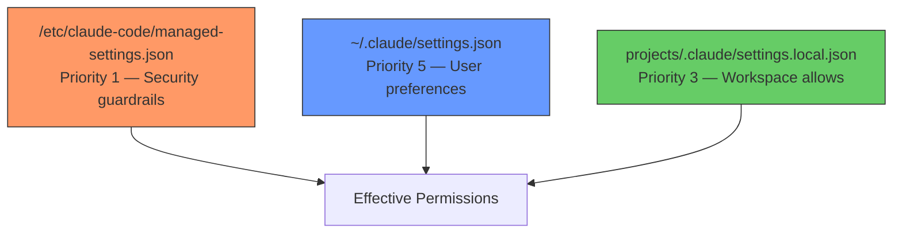
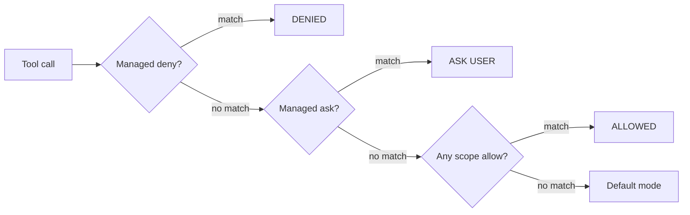

# Settings Hierarchy

Claude Code settings architecture for the `~/projects` workspace.

## 3-Tier Architecture



| File | Priority | Role | Mutable by Claude? |
|------|----------|------|-------------------|
| `/etc/claude-code/managed-settings.json` | 1 (highest) | Security guardrails: deny, ask, stable domain allows | No (sudo only) |
| `~/.claude/settings.json` | 5 (lowest) | User prefs: env, hooks, plugins, sandbox, fallback allows | Yes |
| `projects/.claude/settings.local.json` | 3 | Workspace allow list (comprehensive, replaces user allows) | Yes |

## Permission Evaluation Order



1. **Deny** rules are checked first across all scopes (managed always wins)
2. **Ask** rules are checked next
3. **Allow** rules are checked — first match from highest-priority scope wins
4. **Default mode** applies if no rule matches

**Replacement behavior:** Permission arrays at higher-priority scopes **replace** (not merge with) lower-priority scopes. This means `settings.local.json` (priority 3) replaces `settings.json` (priority 5) allows entirely. The workspace file must include everything the user file provides, plus workspace-specific additions.

## What Goes Where

### Managed Settings (`/etc/claude-code/managed-settings.json`)

Immutable guardrails that apply to all sessions:

- **Deny rules**: Destructive commands (`rm -rf`, force push, `git reset --hard`, `git clean`, `git restore .`)
- **Deny rules**: Sensitive file reads (`.env`, `.pem`, credentials, secrets)
- **Ask rules**: `git push`, `git merge`, `git rebase`, Figma write operations
- **Allow rules**: Stable WebFetch domains (GitHub, Anthropic, PyPI, npm, arxiv, Notion)
- **Allow rules**: Common skills (prime, commit, plans, explore, pre-push-review)

### User Settings (`~/.claude/settings.json`)

User preferences and fallback allows for sessions outside the workspace:

- **Allow rules**: Shell utilities, gh CLI, git read/write ops, Figma read MCP, niche WebFetch domains
- **Env**: Telemetry, error reporting, survey opt-outs
- **Hooks**: PreToolUse hooks (guard-destructive-git, validate-git-c, guard-sensitive-files, guard-docker-secrets, pre-push-review)
- **Plugins**: Enabled/disabled plugin list
- **Sandbox**: Enabled with excluded commands (docker, git)

### Workspace Local (`projects/.claude/settings.local.json`)

Comprehensive allow list for `~/projects` sessions:

- Everything from user settings allows (since this file replaces them)
- **Workspace-specific**: `uv run`, `ruff check`, `pytest`, `mypy`, `docker compose`, `docker exec`
- **Workspace WebFetch domains**: medium.com, docs.docker.com, opencode.ai, etc.
- **Workspace MCP**: Notion search

## Destructive Git Guard

A PreToolUse hook (`guard-destructive-git.sh`) that denies dangerous git subcommands regardless of global options.

### Why this exists

Pattern-based deny rules like `Bash(git clean *)` only match commands starting with that exact prefix. Git allows global options before the subcommand:

```
git -C /path clean -fd          # bypasses "Bash(git clean *)"
git --git-dir=/path push --force # bypasses "Bash(git push --force *)"
git -c user.name=x reset --hard  # bypasses "Bash(git reset --hard *)"
```

The hook parses any git command, strips global options (`-C`, `--git-dir`, `--work-tree`, `-c`, `--no-pager`, `--bare`, etc.), identifies the actual subcommand, and denies destructive operations.

### Denied operations

| Subcommand | Condition | Reason |
|-----------|-----------|--------|
| `clean` | Always | Removes untracked files |
| `reset` | `--hard` flag present | Discards uncommitted changes |
| `push` | `--force`, `-f` (incl. `-fu`, `-fv`), `--force-with-lease` | Overwrites remote history |
| `checkout` | `.` appears as any arg (incl. `HEAD -- .`) | Discards all working tree changes |
| `restore` | `.` appears as any arg, except with `--staged`/`-S` only | Discards all working tree changes |
| `stash` | `drop` or `clear` sub-subcommand | Permanently deletes stashed changes |
| `branch` | `-D` flag or `--delete --force` | Force-deletes branch, may lose commits |

### Compound command / subshell scanning

The hook also scans the entire command string for dangerous patterns when it detects chain operators (`&&`, `||`, `;`, `$()`, backticks) or subshell wrappers (`bash -c`, `sh -c`, `eval`). This catches bypass vectors like:

```
echo foo && git push --force origin main   # chain bypass
true; git clean -fd                        # semicolon bypass
bash -c "git reset --hard HEAD"            # subshell bypass
echo foo && rm -rf .                       # rm in chains
```

This is defense-in-depth — managed-settings deny patterns catch the simple prefix case, and this hook catches global-option, flag-combining, command-chain, and subshell bypasses.

## Sensitive File Guard

A PreToolUse hook (`guard-sensitive-files.sh`) that blocks Bash commands from reading sensitive files, closing a gap where `Read` tool deny rules don't cover `Bash(cat *)` and similar allows.

### Why this exists

Managed-settings deny `Read(**/.env)`, but the allow list includes `Bash(cat *)`, `Bash(head *)`, `Bash(grep *)`. Without this hook, `cat .env` silently bypasses the `Read` deny.

### Protected file patterns

| Pattern | Examples |
|---------|----------|
| `.env`, `.env.*` | `.env`, `.env.local`, `.env.production` |
| `*.pem`, `*.key`, `*.p12`, `*.pfx` | `server.pem`, `private.key` |
| `*credentials*`, `*secret*` | `credentials.json`, `secret-config.yaml` |
| `.netrc`, `.npmrc`, `.pypirc` | Package registry auth files |
| `id_rsa`, `id_ed25519`, etc. | SSH private keys |
| `.ssh/*`, `.gnupg/*` | SSH/GPG directories |

### Guarded commands

File readers: `cat`, `head`, `tail`, `less`, `more`, `bat`, `strings`, `xxd`, `od`, `hexdump`, `base64`
Copy/move: `cp`, `mv`, `rsync`, `scp`
Content search: `grep`, `egrep`, `fgrep`, `rg`, `ag`

Non-reader commands (`ls`, `git`, `echo`, etc.) pass through without inspection.

## Pre-Push Review

A PreToolUse hook (`pre-push-review.sh`) that generates a structured review summary for every `git push` command.

### How it works

1. Hook triggers on any `Bash` tool call containing `git push`
2. Fetches latest remote state, gathers commit log and diff stats
3. Scans for risk patterns (secrets, debug leftovers, TODOs, missing tests, large diffs)
4. Returns `permissionDecision: "ask"` with the summary in `permissionDecisionReason`
5. User sees the summary in the "Allow git push?" dialog before approving

### Risk flags

| Flag | Severity | Trigger |
|------|----------|---------|
| Sensitive patterns | CAUTION | API_KEY, SECRET, PASSWORD, credentials in added lines |
| Large diffs | REVIEW | >500 lines added in a single file |
| Debug leftovers | REVIEW | print(), console.log, breakpoint(), debugger |
| TODO/FIXME/HACK | INFO | New TODO-style comments added |
| Missing tests | INFO | New source files without corresponding test files |

### Manual invocation

Run `/pre-push-review` to get the same analysis without initiating a push.

## How to Add New Permissions

| Want to... | Edit this file |
|-----------|---------------|
| Block a dangerous command globally | `/etc/claude-code/managed-settings.json` → `deny` (requires sudo) |
| Require user approval for a command | `/etc/claude-code/managed-settings.json` → `ask` (requires sudo) |
| Allow a new WebFetch domain everywhere | `/etc/claude-code/managed-settings.json` → `allow` (requires sudo) |
| Allow a tool in all sessions | `~/.claude/settings.json` → `allow` |
| Allow a workspace-specific tool | `projects/.claude/settings.local.json` → `allow` |

When adding to `settings.local.json`, remember it replaces `settings.json` allows — so the new entry must be added there **and** the user file if it should work outside the workspace too.

## Permission Pattern Syntax

All Bash permission patterns use the modern space-based glob syntax:

```
Bash(git push *)       ← correct (space before *)
Bash(git push:*)       ← deprecated (legacy :* suffix)
```

- `Bash(ls *)` matches `ls -la` but NOT `lsof` (space enforces word boundary)
- `Bash(ls*)` matches both `ls -la` AND `lsof` (no word boundary)
- Wildcards can appear at any position: `Bash(git * main)`

The legacy `:*` suffix is documented as equivalent but has known matching bugs with multi-word flag arguments (e.g., `git push --force` deny rules failed to match with `:*`).

## Known Limitations

- `rm` deny covers `-rf` and `-fr` flag orderings but not long-form `--recursive --force` or separated `-r -f` variants — mitigated by sandbox filesystem restrictions and compound-command scanning in the hook
- `find . -delete` and language-level deletion (`python3 -c "shutil.rmtree()"`) are not caught by hooks — mitigated by sandbox filesystem restrictions
- Pre-push hook adds ~1-3s latency from `git fetch --quiet` on every push
- Guard hook uses simple word-splitting to parse git commands — quoted arguments with spaces may not parse correctly (rare in practice)
- Sensitive file guard checks basename patterns; a file at `/tmp/claude/copied-env.txt` renamed from `.env` would not be caught
- Compound command scanning uses broad regex on the raw command string — theoretically could false-positive on deeply nested quoted strings containing trigger words, though safe operations like `git commit -m "Revert force push"` are handled correctly (no chain operator present)
